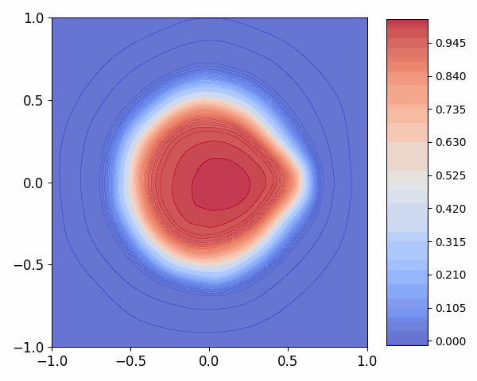
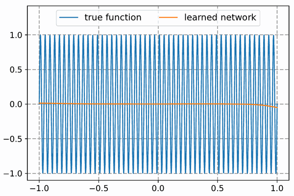
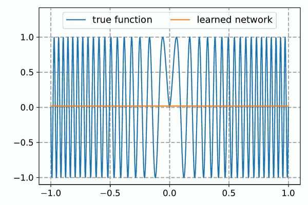

 

# Multi-component and Multi-layer Neural Networks (MMNNs)

This is the github repo for the paper "Structured and Balanced Multi-component and Multi-layer Neural Networks". 

In this work, we design a balanced multi-component and multi-layer neural network (MMNN) structure to approximate functions with complex features with both accuracy and efficiency in terms of degrees of freedom and computation cost. The key idea is based on a multi-layer smooth decomposition each component of which can be approximated effectively by a single-layer network. Using balanced structures in the network reduces the need for large degrees of freedom compared to fully connected networks (FCNNs) and makes the optimization/learning process more efficient. Extensive numerical experiments are presented to illustrate the effectiveness of MMNNs in approximating high oscillatory functions and its automatic adaptivity in capturing localized features. 

## Architecture of MMNNs

Each layer of MMNN is a (shallow) neural network of the form

$$ \boldsymbol{h}(\boldsymbol{x}) = \boldsymbol{A}\sigma(\boldsymbol{W}\boldsymbol{x} + \boldsymbol{b}) + \boldsymbol{c}, $$

where $\boldsymbol{W} \in \mathbb{R}^{n \times d_{\text{in}}}$, $\boldsymbol{A} \in \mathbb{R}^{d_{\text{out}} \times n}$, and $n$ is the width of this network. Here, $\sigma : \mathbb{R} \rightarrow \mathbb{R}$ represents the activation function that can be applied elementwise to vector inputs. 

We call each element of $\boldsymbol{h}$, i.e., $\boldsymbol{h}[i]$ for $i = 1, 2, \ldots, d_{\text{out}}$, a component. Here are a few key features of $\boldsymbol{h}$:

1. Each component is viewed as a linear combination of basis functions $\sigma(\boldsymbol{W}[i, :] \cdot \boldsymbol{x} + \boldsymbol{b}[i])$, $i = 1, 2, \ldots, n$, which is a function in $\boldsymbol{x}$ as a whole.
2. Different components of $\boldsymbol{h}$ share the same set of basis with different coefficients $\boldsymbol{A}[i, :]$ and $\boldsymbol{c}[:]$.
3. Only $(\boldsymbol{A}, \boldsymbol{c})$ are trained while $(\boldsymbol{W}, \boldsymbol{b})$ are randomly assigned and fixed.
4. The output dimension $d_{\text{out}}$ and network width $n$ can be tuned according to the intrinsic dimension and complexity of the problem.

A MMNN is a multi-layer composition of $\boldsymbol{h}_i$, i.e.,

$$ \boldsymbol{h} = \boldsymbol{h}_m \circ \cdots \circ \boldsymbol{h}_2 \circ \boldsymbol{h}_1, $$

where each $`\boldsymbol{h}_i : \mathbb{R}^{d_{i-1}} \to \mathbb{R}^{d_i}`$ is a multi-component shallow network of width $n_i$, where

$$ d_0 = d_{\text{in}}, \quad d_1, \ldots, d_{m-1} \ll n_i, \quad d_m = d_{\text{out}}. $$

The width of this MMNN is defined as $\max\lbrace n_i : i = 1, 2, \ldots, m-1\rbrace$, the rank as $\max\lbrace d_i : i = 1, 2, \ldots, m-1\rbrace$, and the depth as $m$. To simplify, we denote a network with width $w$, rank $r$, and depth $l$ using the compact notation $(w, r, l)$. 

In comparison, each layer in a typical deep FCNN takes the form $\sigma(\boldsymbol{W}\boldsymbol{x}+\boldsymbol{b})$, and each hidden neuron is individually a function of the input $\boldsymbol{x}$ or each point $\boldsymbol{x} \in \mathbb{R}^{d_{\text{in}}}$ is mapped to $\mathbb{R}^n$, where $n$ is the layer width. Typically, all weights are training parameters in FCNNs.

For very deep MMNNs, one can borrow ideas from ResNets to address the gradient vanishing issue, making training more efficient. 

## Decomposition via MMNNs

Although a one-hidden-layer neural network is a low-pass filter that can not represent and learn high frequency features effectively (see our previous paper [here](https://arxiv.org/abs/2306.17301)), we use mathematical construction to show that MMNNs, which are composed of one-hidden-layer neural networks, can overcome this difficulty by decomposition of the complexity through components and/or depth. We emphasize that the decomposition is highly non-unique. Our construction is "man-made" which can be different from the one by computer through an optimization (learning) process. Below are two examples in 1D; for more details, please refer to our paper.

## Numerical experiments

In our paper, we perform extensive experiments to validate our analysis and demonstrate the effectiveness of MMNNs. In particular, our tests show its ability in 1) adaptively capturing localized high-frequency features, 2) approximating highly oscillatory functions, and 3) extending to higher dimensions as well as some interesting learning dynamics. Below are some selected examples; for additional examples, please refer to our paper.

1. Learning process of $f(x)=\sin(50\pi x)$ approximated by a ResMMNN of size (800, 400, 15).
  
   

2. Learning process of $f(x)=\sin(36\pi |x|^{1.5})$ approximated by a ResMMNN of size (800, 40, 15).
  
   

3. Learning process of $f$ approximated by a MMNN of size (500, 20, 8), where $f$ is a 2D function defined in polar coordinates $(r, \theta)$ as

$$
f(r, \theta) = 
\begin{cases} 
0 & \text{if } 0.5 + 5\rho - 5r \leq 0, \\
1 & \text{if } 0.5 + 5\rho - 5r \geq 1, \\
0.5 + 5\rho - 5r & \text{otherwise},
\end{cases}
\qquad \text{where}\qquad  \rho = 0.5 + 0.1 \cos(\pi^2 \theta^2).
$$
  
   

